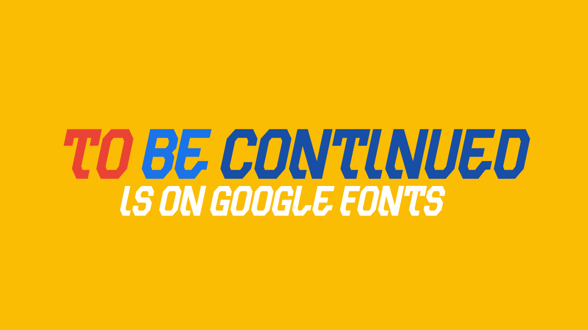
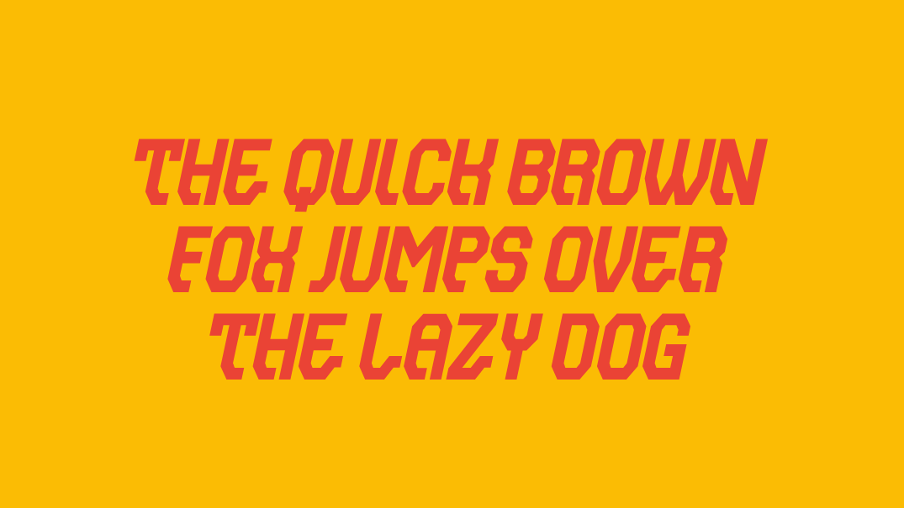

"To be continued" is an common phrase used at the end of a narrative unit or work of fiction that ends on a cliffhanger.

## Variable Font Axe
To be continued has the following axe:

Axis | Tag | Default | Static Instances
--- | --- | --- | ---
Weight | wght | 400 | Regular

